# Handleiding NWB Buitenland

## Inleiding

In deze handleiding komen de stappen aan bod die nodig zijn om vanuit een maandelijkse NWB versie een NWB buitenland te maken.

## Benodigde bronbestanden:

De volgende bronbestanden dienen handmatig te worden gedownload:

**NWB**: de maandversie van de wegvakken en de wkd bestanden van RVM en wegencategorisering.
Deze worden opgeslagen in de map Data\01_NWB\*maand*_*jaar*, voorbeeld:

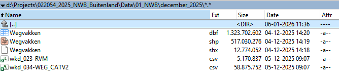

**Vlaams wegenregister**: Deze wordt gedownload via download.vlaanderen.be/product/9449- wegenregister. De shapefile “wegsegment.shp” wordt opgeslagen in de map Data\02_Vlaams_wegenregister\*maand*_*jaar*, voorbeeld:

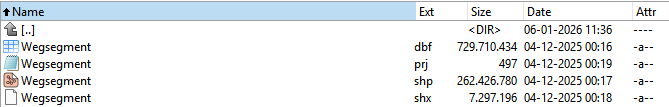

**OSM**: Via https://download.geofabrik.de de volgende 4 downloads maken:

https://download.geofabrik.de/europe/belgium-latest.osm.pbf

https://download.geofabrik.de/europe/netherlands-latest.osm.pbf

https://download.geofabrik.de/europe/germany/niedersachsen-latest.osm.pbf

https://download.geofabrik.de/europe/germany/nordrhein-westfalen-latest.osm.pbf

Deze .pbf’s worden opgeslagen in de map Data\03_OSM\*maand*_*jaar*, voorbeeld

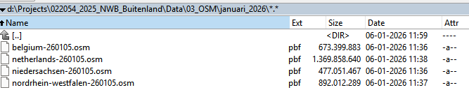

Daarnaast zijn de volgende bestanden nodig om de scripts te kunnen draaien:

**Studiegebied**: een vooraf gemaakte shapefile met de afbakening van het benodigde gebied. Er zijn drie polygonen aanwezig in deze shapefile:

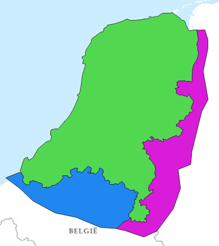

**Studiegebied_dissolve**: een gedissolve variant van hierboven genoemd studiegebied.

Deze bestanden zijn geplaatst in de map Data\04_Studiegebied

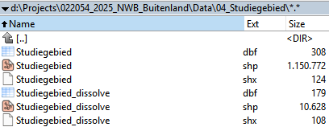

**Grensovergangen**: een polygonen bestand met alle bestaande grensovergangen. Dit bestand wordt gebruikt om controles uit te voeren. Een vlakkenbestand hoef je minder vaak aan te passen dan bijvoorbeeld wvk_id’s of knoopnummers. Aanwezig in de map Data\05_Grensovergangen

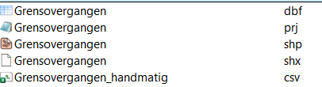

**Uitsluitingen**: een polygonen bestand waarmee uitsluitingen opgegeven kunnen worden. Aanwezig in de map Data\06_Uitsluitingen

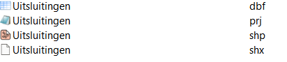

## Scripts

Er zijn een aantal scripts nodig om geautomatiseerd een NWB buitenland te maken. Deze worden hieronder beschreven

***01_Shapebestanden_inladen.bat***

Dit script importeert vijf bron-/hulpbestanden die een shapeformaat hebben:
- NWB
- Vlaanderen netwerk
- Studiegebied
- Grensovergangen
- Uitsluitingen

Bij het importeren van het netwerk van Vlaanderen wordt tijdens de import gelijk de geometrie getransformeerd van SRID 31370 naar 28992. De overige 4 shapebestanden zijn al in de gewenste RD project van 28992.

***02_Overige_bestanden_inladen.sql***

Dit script importeert de drie bronbestanden die een csv formaat hebben:
- WKD van RVM
- WKD van wegencategorisering
- Handmatige verbindingen bij de grenzen. Dit bestand kun je als gebruiker invullen. Ook werkt het script als het je het bestand met uitzondering van de kolomnamen leeghaalt.

***03_Routeerbaar_OSM_genereren_en_inladen.bat***

Dit script voegt de vier .pbf bestanden van OSM samen en maakt van dit samengevoegde .pbf bestand een routeerbaar netwerk (met random knoopnummers). Het netwerk van OSM is namelijk in eerste instantie niet routeerbaar.

Voor het samenvoegen en routeerbaar maken van de OSM pbf bestanden worden twee open source tools gebruikt:
- Osmium: deze is geïnstalleerd via OSGeo4W, maar kan ook worden geinstalleerd via Github (git clone https://github.com/osmcode/osmium-tool). Het is een snelle, open-source toolkit om OSM data te verwerken. Osmium wordt gebruikt om de .pbf bestanden samen te voegen en om deze te clippen met het studiegebied
- Osm2po: dit is een java tooltje die wordt gebruikt om OSM data om te zetten naar een routeerbaar netwerk. De tool staat in de map Scripts\osm2po:

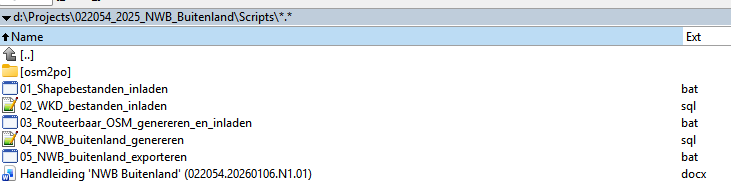

***04_NWB_buitenland_genereren.sql***

Dit script bevat een aantal blokken die hieronder worden behandeld.

*Blok 1: Voorbereiding*

De volgende stappen worden uitgevoerd:
- Indexen aanmaken: Deze zorgen ervoor dat ruimtelijke queries (zoals ST_Intersects, ST_DWithin, etc.) snel worden uitgevoerd.
- Tabellen analyseren: Door het analyseren van de tabellen verzamelt de database statistieken over zowel attribuut- als geometriekolommen. Deze statistieken worden door de query planner gebruikt om efficiëntere uitvoeringsplannen te kiezen, waardoor ruimtelijke queries die later worden uitgevoerd (zoals ST_Intersects, ST_DWithin en ruimtelijke joins) zo optimaal mogelijk presteren.
- Grensovergangen genereren: De grensovergangen tussen de studiegebieden (bijv. Nederland–OSM) worden nodig om OSM-wegvakken op de grens te splitsen.Door de grens een kleine buffer te geven (0.01 meter) worden nauwkeurigheidsproblemen vermeden.

*Blok 2: Vlaanderen netwerk voorbereiden*

De volgende stappen worden uitgevoerd:
- Selectie van relevante Vlaamse wegvakken:
  - Uit de volledige vlaanderen dataset worden alleen wegvakken geselecteerd die binnen het studiegebied Vlaanderen liggen.
  - Wegvakken waarbij begin- of eindknoop 0 is worden uitgesloten (dit zijn ongeldige knopen).
  - Wegvakken met bepaalde categorieën die niet relevant zijn (bijv. “niet gekend”, “niet van toepassing”) worden uitgesloten.
  - Wegvakken met bepaalde lblmorf-waarden (zoals voetgangers- en fietswegen of dienstwegen) worden uitgesloten.
  - Vervolgens worden voor de geselecteerde wegvakken attributen toegewezen en gemapt naar de NWB-structuur: bron wordt gezet op “Vlaams register”, wvk_id, jte_id_beg en jte_id_end worden omgezet naar unieke negatieve ID’s, bst_code wordt gemapt vanuit lblmorf, frc wordt afgeleid uit lblwegcat, en fow wordt afgeleid uit lblmorf. De invulling van de FRC en FOW is overgenomen van het script wat eerder door de opdrachtgever beschikbaar was gesteld;
  - Vlaanderen heeft geen rijrichting dus er wordt verondersteld dat alle wegvakken in beide richtingen zijn opgesteld.
  - De oorspronkelijke geometrie van Vlaanderen is een LINESTRINGM. De M is niet nodig, dus vandaar dat ST_Force2D wordt gebruikt.
- Wegvakken uitsluiten
  - Wegvakken die intersecten met uitsluitingsvlakken worden verwijderd uit osm_relevant.
  - Hiermee worden ongewenste wegvakken (bijv. in niet-relevant gebied of verkeerde typen) uitgesloten, zie onderstaand voorbeeld:

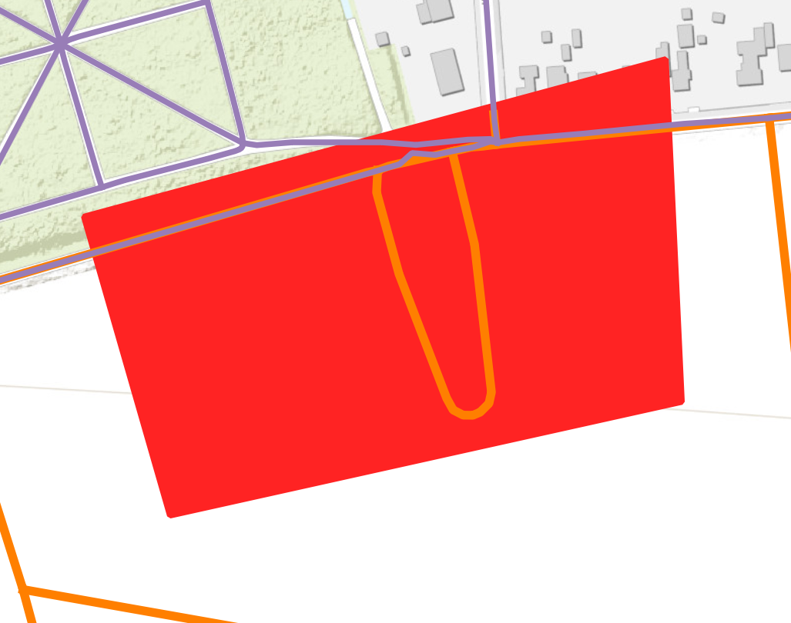

*Blok 3: OSM netwerk voorbereiden*

De volgende stappen worden uitgevoerd: 
- Selectie van relevante OSM-wegvakken
  - Er wordt een selectie gemaakt van OSM-wegvakken binnen het studiegebied.
  - De geselecteerde wegvakken worden voorzien van een set attributen die overeenkomen met de NWB-structuur (o.a. bst_code, frc, fow).
  - De geometrie wordt omgezet naar het RD-coördinatenstelsel (EPSG:28992).
- Unieke identificatie (uniek_id) aanmaken
  - Het routeerbare OSM-netwerk heeft geen uniek wegvak-ID zoals het NWB.
  - Daarom wordt een uniek_id aangemaakt op basis van een serial en negatief gemaakt (zodat het onderscheidbaar is van NWB).
  - Deze uniek_id wordt later gebruikt voor koppelingen en controles.
- Knopen (nodes) genereren
  - Er wordt een knooptabel (osm_relevant_nodes) aangemaakt met alle begin- en eindknopen van de geselecteerde OSM-wegvakken.
  - Voor elke knoop wordt de maximale afstand tussen alle bijbehorende knooplocaties berekend en een centroid bepaald.
  - Deze tabel is later nodig voor het controleren en aanpassen van knooppunten na splitsing.
- Wegvakken uitsluiten
  - Wegvakken die intersecten met uitsluitingsvlakken worden verwijderd uit osm_relevant.
  - Hiermee worden ongewenste wegvakken (bijv. in niet-relevant gebied of verkeerde typen) uitgesloten.
- Wegvakken splitsen bij de grens
  - OSM-wegvakken lopen soms over de grens heen.
  - Om betere automatische koppeling met het NWB mogelijk te maken, worden wegvakken gesplitst op grensovergangen (grensovergangen_lijn).
  - Alleen wegvakken die de grens daadwerkelijk intersecten worden gesplitst.
  - Na splitsing ontstaat een nieuwe tabel osm_relevant_splits.
- Wegvakdelen in Nederland (of op de grens) markeren voor verwijdering
  - Wegvakdelen die binnen Nederland liggen (of precies op de grens) worden gemarkeerd met verwijderen = 1. Dit gebeurt door het middelpunt van het wegvakdeel te testen tegen het studiegebied.
  - Wegvakdelen met een zeer kleine lengte (< 0.11 m) worden ook verwijderd. Dit zijn de wegvakgedeelten die exact op de grens liggen doordat de grenslijn feitelijk een buffer van 0.1 meter is.
- Wegvakken met niet-unieke uniek_id markeren
  - Door de splitsing kunnen sommige originele wegvakken in meerdere delen terugkomen.
  - Alleen het eerste deel mag blijven; overige delen krijgen verwijderen = 1.
  - Dit voorkomt dat één OSM-wegvak later meerdere keren wordt gekoppeld of dubbel voorkomt.
- Gesplitste wegvakken verwijderen
  - Wegvakken die in gesplitste vorm bestaan, worden uit de oorspronkelijke tabel osm_relevant verwijderd.
  - Wegvakken met verwijdering = 1 verwijderen
  - De gemarkeerde wegvakdelen worden daadwerkelijk uit osm_relevant_splits verwijderd.
- Knopen updaten na splitsing
  - Na splitsing kunnen begin- of eindknopen niet meer op de originele locatie liggen.
  - Deze knopen worden eerst leeggezet (naar 0) wanneer de huidige start-/eindpunt niet meer overeenkomt met de originele knooplocatie.
- Nieuwe knopen genereren voor gesplitste wegvakken
  - Voor de wegvakken waarbij de knoop nu 0 is (niet meer aanwezig op de originele plek), worden nieuwe knopen aangemaakt.
  - Deze knopen krijgen een nieuw uniek ID (negatief en afgeleid van een serial). De nummering begint bij -1. Aangezien zowel in OSM als Vlaanderen deze lage knoopnummers niet voorkomen is gekozen om deze nummering niet aan te passen.
- Gesplitste wegvakken weer terugplaatsen in de hoofdset
  - De gesplitste wegvakken met geüpdatete knopen worden teruggezet in de hoofdtafel osm_relevant.
  - Hiermee ontstaat een consistente dataset van OSM-wegvakken met correcte knopen en een uniek ID.

*Blok 4: NWB samenvoegen met relevante links buitenland*

De volgende stappen worden uitgevoerd:
- NWB-wegvakken voorbereiden en standaardiseren
  - Alle relevante attributen van het NWB worden geselecteerd en overgenomen.
  - De tabel wordt uitgebreid met een bron-kolom die voor deze records de waarde ‘NWB’ krijgt.
  - frc wordt bepaald door een combinatie van:
    - de bestaande bst_code (voor ontoegankelijke categorieën),
    - de wegcategorisering (wkd_wegencategorisering),
    - de RVM-codering (wkd_rvm).
  - fow wordt overgenomen wanneer beschikbaar, anders wordt een default waarde 7 gebruikt.
- Vlaanderen toevoegen aan de gecombineerde dataset
  - De eerder gemaakte tabel vlaanderen_relevant wordt toegevoegd aan de gecombineerde tabel.
  - Voor Vlaamse wegvakken worden veel attributen op NULL gezet omdat deze niet in het Vlaamse register aanwezig zijn of niet relevant zijn voor de huidige analyses.
- OSM toevoegen aan de gecombineerde dataset
  - De tabel osm_relevant wordt toegevoegd aan de gecombineerde tabel.
  - Net als bij Vlaanderen worden veel attributen op NULL gezet omdat deze niet beschikbaar zijn in de OSM-bron.
  - Voor OSM wordt wvk_id vervangen door uniek_id, omdat OSM-wegvakken oorspronkelijk geen uniek wegvak-ID hebben.

*Blok 5: Links bij grensgebieden goed verknopen*

De volgende stappen worden uitgevoerd:
- Knopen genereren uit het gecombineerde netwerk
  - Uit nwb_buitenland worden alleen autotoegankelijke wegvakken geselecteerd (dus zonder de bst_code-categorieën die ontoegankelijk zijn).
  - Van deze links worden knopen gegenereerd. Deze knopen zijn ontvankelijk voor koppelingen.
- Nederlandse knopen verbinden aan buitenlandse knopen
  - Voor elke Nederlandse knoop wordt de dichtstbijzijnde knoop uit Vlaanderen of OSM gezocht.
  - Er wordt een afstandscriterium gebruikt van 5 meter. Deze 5 meter is door de opdrachtgever aangegeven.
- Verbindingen terugvertalen naar gecombineerd netwerk
  - Op basis van de gevonden verbindingen worden de buitenlandse wegvakken voorzien van de NWB knoop:
    - jte_id_beg wordt vervangen wanneer de beginknoop overeenkomt met een gekoppelde buitenlandse knoop.
    - jte_id_end wordt vervangen wanneer de eindknoop overeenkomt met een gekoppelde buitenlandse knoop.

*Blok 6: checks*

In dit blok worden een aantal kwaliteitscontroles gedaan:

- Check 1: routeerbaarheid bij grens
  - Vergelijkt vooraf gedefinieerde grensovergangsvlakken met de bestaande knopen/verbindingen in nwb_buitenland.
    - Missende overgangen
      - Als een grensovergangsvlak geen overeenkomstige verbinding heeft, wordt deze als “missende overgang” gemarkeerd.
      - Als de grensovergang categorie 1 heeft, wordt deze als “missende overgang, maar niet cruciaal” gelabeld.
    - Nieuwe overgangen
      - Als een nieuwe overgang binnen 5 meter ligt van een bestaande grensovergang, wordt die als “dicht bij bestaande” gelabeld.
      - Anders wordt het een “nieuwe overgang” genoemd.
  - Op basis van de resultaten van check 1 zijn er een aantal specifieke wegvakken aangepast. Deze handmatige acties worden met Kragten gedeeld.
    - Deze aanpassingen worden opgegeven in het csv bestand Grensovergangen_handmatig.csv die met het script 02_Overige_bestanden_inladen.sql wordt ingeladen. Het is belangrijk om goed op te geven of het begin of eindpunt aangepast dient te worden.
    - Hierbij wordt de geometrie van het (Vlaamse/OSM) wegvak verlengd zodat deze binnen 5 meter komt van een NWB wegvak en dezelfde knoopnummers krijgt.
    - Dit zorgt ervoor dat belangrijke grensovergangen toch verbonden zijn in het netwerk.
- Check 2: links met dezelfde begin- en eindknoop verwijderen
  - alle wegvakken met jte_id_beg = jte_id_end worden opgeslagen in check_2_loop_verwijderd. Dit zijn tot nu toe wegvakken die in het OSM voorkomen.
  - Deze wegvakken worden daarna verwijderd uit het netwerk.
- Check 3: knopenanalyse
  - Er wordt gecontroleerd of knopen het netwerk op meerdere locaties voorkomen.
  - De maximale afstand tussen de verschillende locaties van dezelfde knoop wordt berekend.
  - Knopen die vallen binnen onderstaande tolerantie worden verwijderd
    - Als de bron ‘NWB’ is: verwijder knopen die minder dan 0,1 meter uit elkaar liggen.
    - Als de bron niet ‘NWB’ is (OSM/Vlaams): verwijder knopen die minder dan 5 meter uit elkaar liggen.
    - Hierdoor blijven alleen afwijkende knopen over. Bij de januari 2026 versie liggen deze in Nederland (oftewel in het NWB zelf).
- Check 4: statistieken genereren
  - Berekening van de volgende statistieken:
    - Aantal wegvakken totaal
    - Aantal unieke wegvak-ID’s
    - Aantal wegvakken per bron
    - Aantal wegvakken per FRC-code per bron
    - Aantal wegvakken per FOW-code per bron
    - Topologie-statistieken:
      - aantal wegvakken met knoop 0
      - aantal knopen die op meerdere locaties voorkomen (met grens > 0,1 m)
      - aantal knopen met afwijking > 5 m
    - De FRC/FOW statistieken worden per bron gemaakt. In eerdere versies van het NWB buitenland bleek namelijk dat de FRC klasse 3 niet voorkwam in het NWB. Door de statistieken per bron te genereren wordt dit nu eerder inzichtelijk.

*Blok 7: NWB buitenland met relevante kolommen genereren*

De volgende stappen worden uitgevoerd:
- Eindresultaat-tabel aanmaken
  - Een nieuwe tabel nwb_buitenland_eindresultaat wordt gemaakt.
  - Deze bevat alleen de relevante kolommen uit nwb_buitenland (zoals bron, ID’s, weggegevens, FRC/FOW, geometrie, etc.).
- Buffer rond Nederland maken
  - Een buffer van 5000 meter wordt gemaakt rond het Nederlandse studiegebied (studiegebied tabel).
- Variant met buitenland binnen 5 km van Nederland
  - Een tweede tabel nwb_buitenland_eindresultaat_5km wordt gemaakt. Deze tabel wordt gebruikt voor het koppelen van FCD data.
  - Deze bevat:
    - Alle NWB-wegvakken (zonder afstandsfilter)
    - Alle niet-NWB wegvakken (OSM/Vlaams) die binnen 5 km van Nederland liggen (via buffer intersectie)

*Blok 8: Verschilanalyse eerdere versies*

In dit blok wordt het buitenland netwerk vergeleken met een andere versie. Deze wordt op dit moment hardcoded aangegeven in het script. Bij deze verschilanalyse kwam ook aan het licht dat veel OSM wegvakken zijn weggevallen tussen de januari 2026 versie en december 2025 versie.

***05_NWB_buitenland_exporteren.bat***

Dit script zorgt ervoor dat er twee shapebestanden worden geëxporteerd:
- Een NWB buitenland die het volledige studiegebied beslaat
- Een NWB buitenland die alleen buitenlandse wegvakken binnen 5 km van Nederland bevat.

De shapebestanden worden geplaatst in de map Resultaten\*maand*_*jaar*

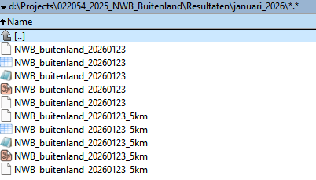

Daarnaast worden ook de controle bestanden geëxporteerd: Checks 1 t/m 3 genereren shapebestanden en check 4 is een txt bestand waarin de statistieken zichtbaar zijn.  De checks worden geplaatst in de map Checks\check_*

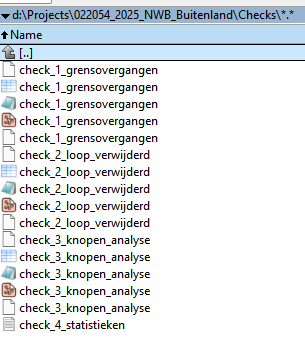

## Locatie NWB buitenland

Het NWB buitenland wordt uiteindelijk gepubliceerd op de volgende locatie: https://maps.ndw.nu/api/v1/nwbForeignCountries/20251201/geopackage/

Het is belangrijk dat hierbij wordt verwezen naar het gebruik van OSM. Bijvoorbeeld: Onder andere afgeleid van OpenStreetMap data © OpenStreetMap contributors, ODbL 1.0. Bewerking door NDW.
